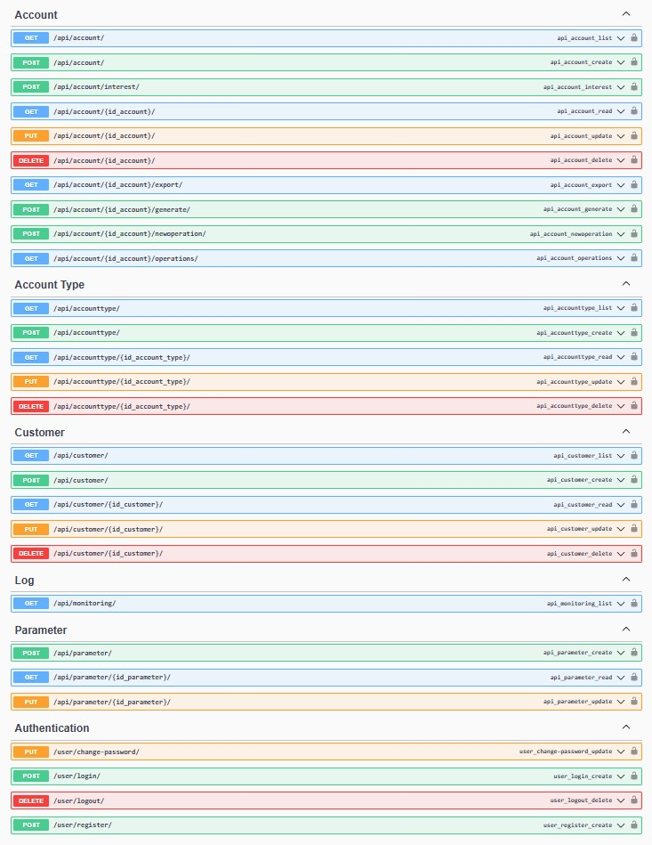

## Table of Contents

* [Project Title](#project-title)
* [Description](#description)
* [Features](#features)
* [Technology](#technology)

# Project Title

MiniBank

## Description

Scope of this project is a backend for minibank application.

  

## Features

A few of the things you can do with this application:

* User authentication
* Customer master data management
* Account functions:
  * Creation of account
  * Generation IBAN number
  * Deposit / Withdrawal operation
  * Interest counting
  * Listing history operations 
* Exporting operations to excel file
* Activity monitoring in the background

## Technology

* Python 3.12
* Django 5.0
* DRF 3.15
* PostgreSQL 17.0
* Redis 7.0
* Nginx 1.27
* Docker-compose 2.29
